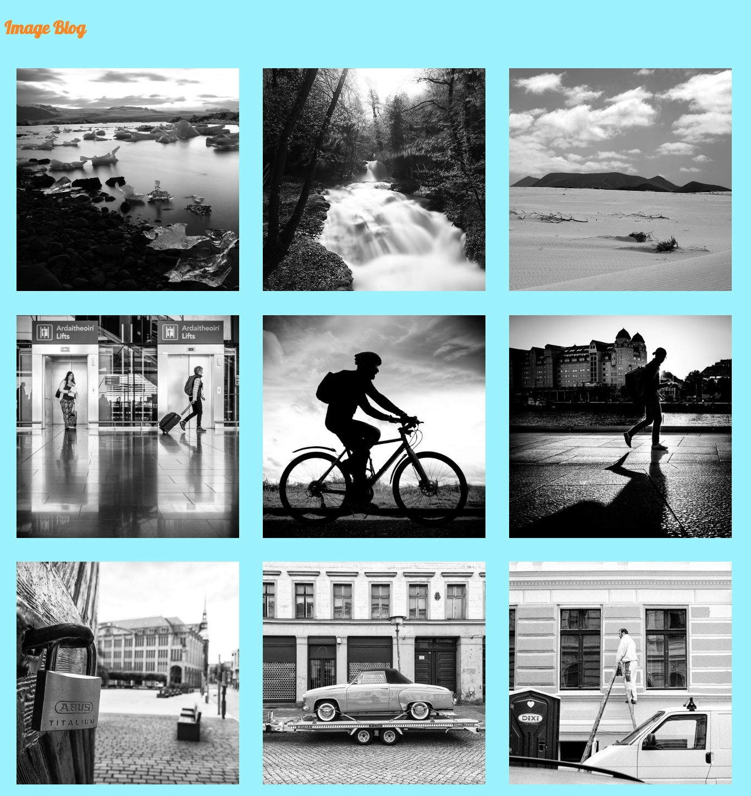

# Photo Blog

This is simple photo blog using Html and CSS

## Demo

https://photo-blog01.vercel.app/

## Tech Stack

HTML, CSS

## Features

- Static Photo Blog

## Authors

- Shailesh Kolap - [skolap](https://github.com/Skolap)

## Screenshots

  
 

<!-- 

 -->
